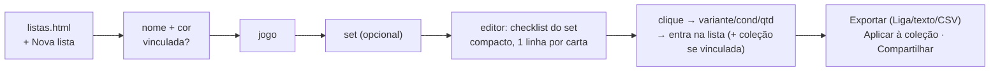

# Listas — cadastro em massa, listas nomeadas e export pra Liga

Plano da feature **e** registro do que foi construído. Complementa o
[ROADMAP.md](../ROADMAP.md); segue o formato de [DECKS.md](DECKS.md) e
[COMMUNITY-PRICES.md](COMMUNITY-PRICES.md) (fases F0–F5, cada uma entregável
sozinha).

> **Estado: F0–F5 implementadas** (branch `feat/listas`, 2026-08-12). As
> decisões da seção 11 foram batidas pelo Fernando: nome "Listas", tags migradas
> de verdade, default avulso no wizard, e os 4 itens do export da Liga ficam
> como teste manual antes de anunciar. O que mudou do plano durante a execução
> está na seção 12; o que ficou de fora, na 13.

**Tese:** hoje adicionar 200 cartas de um set é clique por clique numa grade de
imagens. A feature cria (1) um **modo de visualização compacto** sem imagem,
pensado pra velocidade; (2) **Listas nomeadas** — sucessoras das Tags — em que
adicionar numa lista pode adicionar também na coleção; e (3) **export em texto**
no formato de importação da Liga (Compra por Lista), pra comprar em bulk.

Escrito em 2026-08-12, a partir da auditoria do código desta data.

---

## 1. O que os outros sites fazem (e o que copiar)

| Site | O que tem | O que copiar | O que evitar |
|---|---|---|---|
| **TCGCollector** (a referência do pedido) | Modo "List" por linha: badge de qtd, botões −/+, botão dedicado **"Manage card in list"**, "mais opções", nome, set, número, preço. Sem imagem (só no clique). "Lists" é item de menu de primeira classe. | A anatomia da linha inteira; o botão de lista no MESMO lugar em todas as visualizações; listas como seção própria. | A troca grid↔list deles recarrega a página (server-rendered); a nossa é CSS, manter assim. |
| **Moxfield** | Import/export de coleção por CSV/texto: `Count, Name, Edition, Condition, Language, Foil, Tag`. Tags viajam no import/export. | O CSV como formato de export secundário (Magic) — dá interop de graça. | Validação frouxa de edição (typo cai no "primeiro set em ordem alfabética"). |
| **Deckbox** | Inventário com 3 colunas editáveis inline (Inventory/Tradelist/Wishlist); "Edition Checklist" pra entrada em massa por set. | O conceito de checklist por set = nosso fluxo guiado. | Checklist é paywall lá; aqui é grátis (tese do projeto). |
| **Archidekt** | Import de CSV com coluna de tag aplica as tags na entrada. | Import de lista com destino (F6, futuro). | — |
| **Liga (Compra por Lista)** | Importa `qty nome [qualidade=][edicao=][idioma=][extras=]`; Pokémon usa `(num/total)` no lugar de edição. | É o **alvo do export** — seção 6. | — |

O nosso diferencial sobre todos: o fluxo por set com **variante escolhida na
linha** (Normal/Foil/Reverse/condição) sem abrir modal nenhum.

---

## 2. Decisões de design

**D1. Lista substitui Tag — por evolução, não por big bang.** Uma Lista é uma
Tag que cresceu: tem nome+cor (igual), mas as entradas carregam **variante,
quantidade e condição**, têm **ordem**, e a lista pode conter carta que você
**não tem** (lista de compras). A migração Tags→Listas é a última fase (F5);
até lá as duas convivem sem conflito (stores e `SYNC_KEYS` separados).

**D2. Dois tipos de lista.** `linked: true` (**vinculada**): cada carta
adicionada na lista é adicionada **também na coleção** na hora — é o "cadastrar
minha coleção por lista" do pedido. `linked: false` (**avulsa**): só a lista —
wishlist de compra, deck planejado, "cartas pra lembrar". Avulsa tem o botão
**"Aplicar à coleção"** (em massa, com prévia). Remover da lista **nunca**
remove da coleção, em nenhum modo.

**D3. Página própria (`listas.html`), não aba da coleção.** O fluxo guiado
(escolher set → checklist) precisa de tela cheia; aba apertaria. Entra como
card no dashboard (o "botão na home da coleção" do pedido) e no array
`collectionActive` do menu. Precedente: `my-decks.html` (pessoal, `noindex`).

**D4. O modo "minimalista" é o 3º modo de visualização global, não um modo da
página de listas.** O toggle atual grid/lista (`data-grid-view`) ganha
`compact`. Vale em Cartas, Detalhe (set/artista), Coleção e Wishlist — e é o
modo default do editor de listas. Sem imagem no DOM (nem escondida — não pode
baixar); miniatura flutuante no hover, reusando o padrão da seção Impressões
(`data-print-img` + thumb flutuante, `src/shared.js:3847-3863`).

**D5. "Versão" na linha = variante do card (Normal/Foil/Reverse/…).** Arte
alternativa / extended art / Tolkien treatment **já são outra carta** no
catálogo (ex.: `op-544523` vs `op-544524`, mesmo número EB01-001) — no fluxo
por set elas já aparecem como linhas próprias. A caixinha da linha só escolhe
variante + condição + quantidade. "Outras impressões deste nome" (busca por
nome, padrão `fillPrints`) é extensão em F4.

**D6. Export por configuração por jogo** (seção 6): Liga (texto), texto puro
`qty nome` (compatível com o import dos decks) e CSV (Magic no formato
Moxfield; demais no CSV padrão do site).

**D7. Aplicar à coleção com prévia.** Reusa o padrão do import de CSV
(`showCsvImportPreview`, `src/shared.js:7638`): modal com o delta antes de
gravar. Default **soma** (+q); opção "definir quantidade exata" (idempotente,
padrão do import Dex).

**D8. Sync e backup no padrão decks.** Store global cross-game
(`tcg-collector-lists-all-v1`), tombstones em `deleted`, LWW **por lista**
(não por blob inteiro como as tags — duas máquinas editando listas diferentes
não se perdem). Entra em `SYNC_KEYS` e no backup JSON desde F0.

---

## 3. Modelo de dados

```js
// localStorage["tcg-collector-lists-all-v1"] — global, cross-game (padrão decks)
{
  lists: [{
    id: "ls_<ts36><rand5>",        // padrão uid das tags/decks
    name: "Hobbit pra comprar",     // ≤ 40 chars
    color: "#3b6fe0",               // reusa TAG_COLORS (src/collection.js:94)
    game: "magic" | null,           // null = lista mista (só via botão do tile)
    setId: "hob" | null,            // set do fluxo guiado (pra "voltar ao checklist")
    linked: false,                  // D2: true = cada add grava também na coleção
    entries: [                      // ORDENADAS (ordem de inserção; drag depois)
      { id: "mtg-hob-283",          // cardId do catálogo
        v: "Foil" | null,           // variante; null = "qualquer" (entradas migradas de tag)
        q: 1,                       // quantidade
        c: "NM",                    // condição (CARD_CONDITIONS; default NM)
        at: 1723400000000 }
    ],
    fromTag: "t_..." | undefined,   // proveniência da migração (F5)
    createdAt, updatedAt
  }],
  deleted: { "ls_x": ts }           // tombstones (padrão decks, src/decks.js:31-33)
}
```

- **Chave lógica da entrada: `id|v`.** Adicionar o mesmo par incrementa `q`.
- **Sem limite de 15** (o `TAG_LIMIT` não se aplica); teto de sanidade: 100
  listas, 5000 entradas/lista (aborta com toast antes de estourar quota).
- Store novo `createListStore()` em `src/listas.js`, com a mesma API-superfície
  dos irmãos: `list, get, create, rename, setColor, remove, addEntry,
  removeEntry, setQty, entriesOf, listsWith(cardId), toggleEntry`.
- Escrita via `scheduleWrite` (`src/shared.js:24`) como todo mundo.

### Sync (F0)

- `SYNC_KEYS.lists = "tcg-collector-lists-all-v1"` em `src/shared.js:~6190`
  (bloco global, junto de `decks`/`binders`).
- `mergeLists(a, b)` em `src/shared.js` junto dos outros merges (~6676): união
  por `id`, LWW por `updatedAt` **de cada lista**, tombstones vencem criação
  mais antiga, poda com o mesmo TTL do `pruneTombstones` (`shared.js:6416`).
- Cliente antigo que não conhece a chave só **não envia** `lists` no snapshot;
  o merge por chave (`a || b`) preserva o valor remoto — mesmo comportamento
  já validado com `tags`/`decks`. Nada quebra em rollout gradual.
- **Backup**: incluir `lists` em `backupObject()`/`importJson()`
  (`src/shared.js:7480/7508`). Obs.: `decks` está fora do backup hoje — bug
  separado, já registrado como tarefa própria.

---

## 4. UI

### 4.1 `listas.html` — galeria

Molde padrão da área Coleção (`page-head` + `← Hub`, ver `wishlist.html:47`):

- Grade de cards de lista (padrão da vitrine de tags, `tagCardHtml`,
  `src/collection.js:1149`): cor, nome, nº de cartas, valor somado
  (`shared.cardValue` por entrada), badge "vinculada"/"avulsa", capa = carta
  mais valiosa.
- Botão **"+ Nova lista"** → wizard (4.2).
- Entradas de navegação:
  - `src/dashboard.js:119` — novo item no array `links`
    (`{ href: "listas.html", icon: "lists", key: "nav.lists", stat: tn("count.lists", n) }`)
    + ícone em `IC` (`dashboard.js:104`).
  - `src/shared.js:1409` — `"listas"` no array `collectionActive`.
  - `data-active-page="listas"`.
- Scripts na ordem obrigatória: `i18n.js → i18n-listas.js → shared.js → listas.js`
  (padrão `my-decks.html:55-60`). `noindex`, fora do sitemap/prerender.

### 4.2 Wizard "Nova lista"

Modal em 3 passos (padrão `openNewDeckModal`, `src/decks.js:1350` — inclusive o
cuidado com `data-pick-game`, nunca `data-game`):

1. **Nome + cor** (paleta das tags) + tipo: `( ) Só uma lista` /
   `(•) Adicionar também na coleção` — o texto explica a diferença em 1 linha.
2. **Jogo** — grade de logos (reuso do passo 1 dos decks).
3. **Set (opcional)** — seletor com busca (dados do manifest de sets do jogo);
   botão "Sem set — buscar carta a carta" pula direto.

Cria a lista e abre o editor. Total: 3 cliques até a primeira carta.

### 4.3 Editor da lista

Layout de 2 painéis (padrão editor de decks, `src/decks.js:1551`):

- **Painel esquerdo — a lista**: linhas compactas (4.4) com stepper de qtd,
  chip de variante/condição (clica pra editar), remover, e rodapé com totais
  (nº de cartas, valor ≈ R$). Cabeçalho: nome editável, cor, toggle
  vinculada/avulsa, botões **Exportar** (seção 6), **Aplicar à coleção** (só
  avulsa, D7), **Compartilhar** (F4), excluir (toast-undo padrão
  `snapshotKeys`+`toastUndo`, `src/shared.js:1105`).
- **Painel direito — a fonte**:
  - **Com set** (o fluxo do pedido): todas as cartas do set, **uma vez cada**
    (`cardVariantPairs` com `{group:true}`, `src/shared.js:4379`), em modo
    compacto, na ordem do set. Carrega só o chunk do set
    (`data/<jogo>/sets/<setId>.json` via `shared.loadGameCatalog` — zero D1).
    Filtro rápido por nome no topo (client-side, o chunk já está na memória).
  - **Sem set**: busca com o caminho duplo dos decks — `searchApi` (D1) +
    fallback `search-index.json` com índice de prefixo (`src/decks.js:153,
    1723-1745, 1828`). **Refatoração F1**: extrair esse widget pra
    `shared.createCardSearchSource(game)` e fazer `decks.js` consumir o
    extraído (mesmo comportamento, um dono só).

**Interação de adicionar** (o coração da feature):

- Carta de **1 variante**: clique no `+` da linha adiciona `{v, q:1, c:"NM"}`
  na hora. Flash "✓ Adicionada" (padrão `flashTileAdded`, `src/shared.js:4654`).
- Carta de **várias variantes** (ou clique no chip da linha): expande um
  **popover inline** na própria linha — sem modal:

  ```
  [ Normal ] [ Foil ] [ Reverse ]     ← chips (cardVariants(card), NUNCA card.variants)
  Condição [NM ▾]   Qtd [− 1 +]
  [ Adicionar ]
  ```

  A última escolha de condição fica lembrada na sessão (velocidade em sets
  inteiros na mesma condição).
- Lista **vinculada**: o mesmo clique chama `store.add(cardId, v, c, +q)` da
  coleção do jogo (`src/shared.js:276`) — um clique, dois destinos.
- A linha da fonte mostra badge com a qtd já na lista (e na coleção, discreta).
- Teclado (F4): `/` foca busca, ↑↓ navega, Enter adiciona, F alterna foil.

### 4.4 Modo compacto (o 3º modo de visualização)

**Onde:** toggle existente ganha 3º botão `data-grid-view="compact"` em
`cards.html:115`, `detail.html:167`, `collection.html:135`, `wishlist.html:135`.
Os valores persistem nas chaves atuais (`tcg-cards-view` etc.) — `"compact"` é
só um valor novo; quem tem `"grid"`/`"list"` salvo não muda nada.

**Como:** `variantTile(card, variant, store, wishlist, prices, opts)` ganha
`opts.compact` (`src/shared.js:4418`):

- **Não emite o ``** (display:none ainda baixaria a imagem). No lugar, o
  nome ganha `data-hover-thumb="<url>"`; um handler compartilhado mostra a
  miniatura flutuante (mesmo mecanismo e CSS da thumb das Impressões,
  `.preview-print-thumb`, `styles.css:2793`). No touch, tap longo abre o popup.
- Linha (grid CSS, uma carta por linha, ~40px):

  ```
  [×N] [Nome + bandeira]  [set · número]  [raridade]  [variante]  [≈ R$]  [♥ ≡+ − +]
  ```

  Mobile (`≤700px`): 2 linhas — nome+número em cima, preço+ações embaixo
  (breakpoint padrão do `is-list` dos sets, `styles.css:1396-1442`).
- CSS novo `.card-grid.is-compact` ao lado de `.is-list` (`styles.css:1366`).
- Os handlers atuais (`data-own-*`, `data-minus-*`, `data-want-*`) funcionam
  sem mudança — a delegação é por atributo, não por layout.
- `refreshTileOwnership` (`src/shared.js:4518`): a assinatura em
  `dataset.tileState` (`:4563`) já cobre qtd/desejo; o modo compacto não
  adiciona estado novo → sem mudança na assinatura.
- No modo **agrupado + compacto**, o `+` abre o popover de variante do 4.3 em
  vez do popup do card (no grid agrupado continua abrindo o popup, como hoje).

**Nomenclatura** (pra não colidir com a feature): o modo chama **"Compacta"**
(`view.compact`), nunca "Lista" — o toggle atual já usa "Lista" pro modo com
miniatura.

### 4.5 Botão de lista no tile e no popup

- **Tile** (`src/shared.js:4496-4511`): novo botão `.tile-btn.tile-list`
  (ícone ≡+), `data-list-card-id`/`data-list-variant`, **primeiro** da fileira
  com `margin-right:auto` — encostado no canto esquerdo, espelhando o `+` do
  direito (o "outro canto" do pedido). Ordem final: **lista** → pasta →
  coração → − → +.
- Clique abre popover: listas existentes com check (entrada `id|v` presente) e
  contagem, + "Nova lista…". Clicar numa lista adiciona `{v, q:1, c:"NM"}` (e
  na coleção, se vinculada); clicar de novo remove a entrada. Base de código:
  reviver o padrão do popover morto `openTileTagMenu`
  (`src/collection.js:1054`) — que hoje é inalcançável — já no lugar certo
  (`shared.js`, porque o tile é global).
- **Botão stateless no tile** (ícone fixo, estado só no popover) → não entra na
  assinatura do `tileState`, zero risco de tile congelado.
- **Popup do card**: bloco "Listas" na `.preview-org-row`
  (`src/shared.js:3749`), ao lado de Coleção/pasta e Tags — chips das listas
  que contêm a carta + "+ Lista". Mesmo popover do tile. (Em F5 o bloco de
  Tags é absorvido por este.)

---

## 5. Fluxo do pedido, ponta a ponta



O caso "só quero cadastrar minha coleção rápido": lista **vinculada** + set →
vai clicando; a lista em si vira um registro de sessão que pode ser apagado
depois (ou mantido como memória do que veio daquele set).

---

## 6. Export

Botão **Exportar** no editor → modal com abas, textarea somente-leitura,
**Copiar** (clipboard com fallback, padrão `copyDeckText`, `src/decks.js:1334`)
e download `.txt`/`.csv`.

### 6.1 Formato Liga (Compra por Lista)

Linha-modelo: `<qtd> <nome> [qualidade=<c>][edicao=<sigla>][idioma=<x>][extras=<e>]`
— Pokémon troca `[edicao=]` pelo número impresso `(NNN/TTT)`.

| Campo | Fonte no catálogo | Regra |
|---|---|---|
| qtd | `entry.q` | `q` nulo (entrada migrada de tag) = 1 |
| nome | `card.name` | One Piece/FAB/Gundam: **remover sufixo** `(Alternate Art)`/`(Parallel)` etc. — regex de parêntese final, a mesma do import de decks (`src/decks.js` `parseDeckText`) |
| qualidade | `entry.c` | escala já é a da Liga (M/NM/SP/MP/HP/D, `src/shared.js:154`) — 1:1 |
| edicao | Magic: `setId` do id `mtg-<set>-<num>`; demais: sigla do set quando houver | maiúscula; omitir se não confiável |
| idioma | sufixo do id (`-pt`→PT, `-ja`→JP) | omitir pra EN (default da Liga) |
| extras | variante | `Foil`→`foil`; `Etched`→`etched`; Magic pode anexar `treat` mapeado (borderless, extended art…) filtrado por `TREAT_NOISE` (`src/shared.js:5228`) — best-effort |
| (NNN/TTT) | Pokémon: `card.number`/`card.setTotal` | pad de ambos pra 3 dígitos (`078/084`), como impresso na carta |

Exemplos (dados reais do catálogo):

```
1 Bilbo, Thief in the Night [qualidade=NM] [edicao=HOB] [extras=foil]
1 The Arkenstone // Seek the Heart [qualidade=NM] [edicao=HOB] [extras=foil]
```

```
1 Gwynn (078/084) [qualidade=NM]
2 Mega Darkrai ex (116/084) [qualidade=NM]
```

Implementação: `src/export-liga.js` (funções puras, sem DOM) com config por
jogo + default conservador (`qty nome [edicao=…]`). **Itens a verificar na
Liga antes de fechar F3** (checklist manual, colar no Compra por Lista):
sigla vs nome de edição no Magic; formato aceito pra One Piece/Lorcana nas
outras Ligas; `PT` vs `BR` no idioma; vocabulário exato de `extras`.

### 6.2 Texto puro

`<qtd> <nome>` — o formato que `parseDeckText` (`src/decks.js:1250`) já lê.
Uma lista exportada assim **importa num deck do site** sem conversão.

### 6.3 CSV

- **Magic**: header Moxfield `Count,Name,Edition,Condition,Language,Foil` —
  interop direta com Moxfield/Archidekt.
- **Demais jogos**: o CSV padrão do site (`buildCollectionCsv`,
  `src/shared.js:4165` — `;`, BOM, vírgula decimal).

### 6.4 Testes

`tests/liga-export.test.mjs`: linhas douradas por jogo (Magic com foil+treat,
Pokémon com pad, One Piece com sufixo removido, entrada `v:null`, `q` nulo).
**Atenção**: adicionar o teste novo ao workflow do CI explicitamente — hoje o
CI roda só parte dos testes da pasta.

---

## 7. Integrações (F4)

| Destino | Ação | Custo |
|---|---|---|
| **Coleção** | "Aplicar à coleção" (D7) com prévia; soma ou define | já descrito |
| **Decks** | "Criar deck desta lista": `createDeck` + `zones.main = entries` (id/qty/variant mapeiam 1:1 pro shape do deck, `src/decks.js:21`) | baixo |
| **Showcase/pastas** | "Criar pasta desta lista": povoar `folders.assign` | baixo |
| **Compartilhar** | `createShare("collection", nome, {scope:"list", entries…})` — precedente exato do share de tag (`src/collection.js:1968`); o CHECK de `shares.kind` já aceita `collection`, zero migração SQL. Import do share recria a lista (padrão `:2243`) | baixo |
| **Perfil público** | listas públicas ao lado das tags — adiar pra F5, quando o payload `tg` passa a ser derivado das listas (viewer não muda) | médio |

---

## 8. i18n, deploy e guardas

- Pacote novo `src/i18n-listas.js` (padrão `i18n-decks.js`): **pt, en e es
  desde o primeiro commit** — paridade tripla é ERRO no `check.mjs` (#3/#3b), e
  o check #7 já valida escopo de pacote automaticamente pelo nome do arquivo.
  O `split-i18n.mjs` do deploy também pega o arquivo pelo padrão de nome.
- **`{game}` é token reservado** do `t()` (jogo da sessão) — telas que falam do
  jogo da LISTA usam `{listGame}` (precedente: `{deckGame}`,
  `src/i18n-decks.js:30`).
- Strings novas principais: `nav.lists`, `lists.new`, `lists.linked`,
  `lists.standalone`, `lists.applyToCollection`, `lists.export.*`,
  `view.compact`, `tile.addToList`.
- `listas.html` com `noindex`; fora de `STATIC_PAGES` do prerender e do
  sitemap (é área pessoal, como `my-decks.html`).
- Busca livre herda os cuidados do D1: teto de 2000 linhas/termo — consultas
  montadas de nome tiram stopwords ("the" etc.), como o `fillPrints` já faz
  (`src/shared.js:3436`).

---

## 9. Fases

| Fase | Entrega | Toca em | Tamanho |
|---|---|---|---|
| **F0** | Store + sync + backup: `createListStore`, `SYNC_KEYS.lists`, `mergeLists`, backup JSON, teste de merge | `shared.js`, `tests/` | ½ dia |
| **F1** | `listas.html` completa: galeria, wizard, editor com fluxo por set e busca livre (extração do widget de busca dos decks) | página nova, `listas.js`, `i18n-listas.js`, `decks.js` (refactor), `dashboard.js`, `shared.js:1409` | 2–3 dias |
| **F2** | Modo compacto global (4 páginas) + botão ≡+ no tile + bloco no popup | `shared.js` (`variantTile`, handlers, popover), `styles.css`, 4 HTMLs | 1–2 dias |
| **F3** | Export Liga/texto/CSV + "Aplicar à coleção" com prévia + testes dourados | `export-liga.js`, `listas.js`, CI | 1–2 dias |
| **F4** | Integrações: deck/pasta a partir da lista, compartilhar/importar share, teclado | `listas.js`, `decks.js`, `collection.js` | 1 dia |
| **F5** | Migração Tags→Listas: conversão one-time (tag → lista vinculada, entradas `v:null`), aba Tags aponta pra Listas, payload do perfil derivado das listas, limpeza do código morto de tags (`openTileTagMenu`, CSS órfão `styles.css:4723`) | `collection.js`, `shared.js`, `listas.js` | 1–2 dias |

Cada fase é shippável: F0 é invisível, F1 já resolve o fluxo pedido pelos
usuários (com export vindo em F3), F2 acelera o site inteiro, F5 só quando
F1–F4 estiverem assentadas.

### Migração (F5) em detalhe

1. No init do store: se `tags` tem dados e nenhuma lista tem `fromTag` →
   converter cada tag em lista `{linked: true, fromTag: tag.id, entries:
   assign[cardId] → {id, v: null, q: null}}`. `v/q` nulos = "marcador", exibido
   como a tag exibia (sem quantidade).
2. O blob de tags **não é apagado** — congela (devices antigos seguem lendo);
   remoção do store legado só depois de um ciclo de semanas.
3. Perfil público: `readTagsData()` (`src/shared.js:7189`) vira adaptador que
   lê as listas e emite o mesmo shape `{tags, assign}` → payload `tg` e viewer
   intactos.

---

## 10. Riscos e armadilhas (do código real)

- **`cardVariants(card)` sempre, nunca `card.variants`** — existem cartas com
  `variants: []` no catálogo (`src/shared.js:143-148`).
- **`variantTile` é o construtor único de tile** — `opts.compact` mal feito
  quebra 7 grades de uma vez. Testar todas + perfil público.
- **`tileState`**: botão de lista stateless e modo compacto sem estado novo →
  assinatura (`src/shared.js:4563`) não muda. Se algum dia o botão mostrar
  estado, a assinatura TEM que incluí-lo (senão tile congela).
- **LWW por lista**: editar a MESMA lista em 2 devices offline perde um lado
  (igual decks). Aceito e documentado; entradas não fazem união.
- **Quota**: `scheduleWrite` + `notifyStorageFull` já cobrem; tetos de
  sanidade da seção 3.
- **Refactor da busca dos decks** (F1) é a mudança mais arriscada — fazer em
  commit separado, comportamento idêntico, antes de qualquer feature em cima.
- **Trabalho concorrente no repo**: fases pequenas, commits cedo, reconferir o
  disco antes de cada commit.

---

## 11. Decisões batidas (2026-08-12)

1. **Nome**: "Listas"; o modo de visualização novo chama **"Compacta"**, pra não
   colidir com o modo "Lista" atual (que tem miniatura).
2. **Migrar as Tags de verdade** — feito na F5.
3. **Default avulso** no wizard (ação destrutiva zero), com o toggle visível.
4. Export da Liga: os 4 itens "a verificar" da seção 6.1 seguem como **teste
   manual** antes de anunciar.

---

## 12. O que mudou do plano na execução

Cinco desvios, todos por motivo encontrado no código:

1. **O store das Listas vive no `shared.js`, não em `listas.js`.** O plano o
   colocava na página. Mas o botão do tile e o bloco do popup do card são de
   `shared.js` — e foi exatamente por o store das tags estar em `collection.js`
   que nasceu o `readTagsData`, uma segunda leitura do mesmo blob que podia
   divergir. Instância ÚNICA por página, senão o popover e a página de listas
   sobrescrevem um ao outro no próximo save.
2. **`setId` virou `set` (nome do set).** O índice `indexes-sets.json` traz
   `{name, cardIds}` — não tem id de set. O nome é também o que a página de set
   usa na URL.
3. **`nav.lists`, `lists.new`, `lists.untitled`, `tile.addToList` e
   `view.compact` ficaram no `i18n.js` core**, não no pacote da página: quem as
   usa é o `shared.js` (todas as páginas) e a dashboard. O check #7 pegou isso
   na hora.
4. **O carregador do índice de busca saiu do `decks.js` pro `shared.js`**
   (`loadSearchIndex`) — o refactor que o plano previa, feito porque agora são
   dois consumidores. O índice de prefixo e as facetas ficaram no editor de
   decks, que é onde são usados.
5. **Duas correções de durabilidade que o plano não previa**, ambas do mesmo
   tipo: o snapshot do desfazer é lido do `localStorage`, mas as escritas são
   adiadas em 250ms (`scheduleWrite`) — então o flush pendente disparava DEPOIS
   do restore e regravava por cima o que o usuário acabara de desfazer. Excluir
   lista passou a gravar síncrono (`saveNow`), e "aplicar à coleção" tira o
   snapshot antes e chama `shared.flushPendingWrites()` depois.

## 13. O que ficou de fora (e por quê)

- **Compartilhar lista por link.** Tem precedente pronto (`shares` com
  `data.scope`), mas o viewer `?s=` é uma tela própria — fazer de raspão
  entregaria um link que abre uma coleção mal rotulada. Fica como próximo passo
  natural da feature.
- **"Criar pasta desta lista".** O store de pastas vive dentro de
  `collection.js` e não é compartilhado; extrair sem necessidade seria mexer no
  Showcase por tabela.
- **Filtro por lista na barra da Coleção.** Mesma pendência que as tags já
  tinham.
- **Limpeza final do código morto das tags** (`openTileTagMenu`, CSS órfão em
  `styles.css`, a chave `tags.deleteConfirm`): o blob de tags foi mantido de
  propósito por um ciclo, e limpar a UI antiga junto com a migração aumentaria a
  superfície de um commit que já mexe em dado de usuário.
